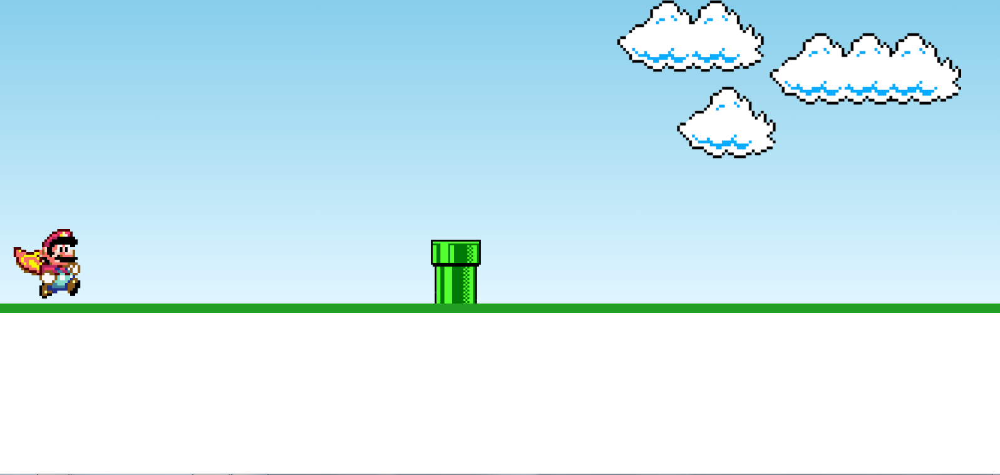

<h1 align="center"> Mario Jump </h1>

Programa gratuito, promovido pela Canal Manual do Dev no Youtube   

  <a href="#-tecnologias">Tecnologias</a>&nbsp;&nbsp;&nbsp;|&nbsp;&nbsp;&nbsp;
  <a href="#-projeto">Projeto</a>&nbsp;&nbsp;&nbsp;|&nbsp;&nbsp;&nbsp;
  <a href="#-layout">Layout</a>&nbsp;&nbsp;&nbsp;|&nbsp;&nbsp;&nbsp;

 

  

## 🚀 Tecnologias

Esse projeto foi desenvolvido com as seguintes tecnologias:

- HTML e CSS
- JavaScript
- Git e Github

## 💻 Projeto

O projeto mario jumo é um simples simulador do jogo do Mario que o obejetivo é pular os encanamentos.
Utilizei o programa para estudar funções e animações.

## 🔖 Layout

Você pode visualizar o layout do projeto acessando o canal Manual do Dev no Youtube

---

Feito com ♥ by Wellingto Sato